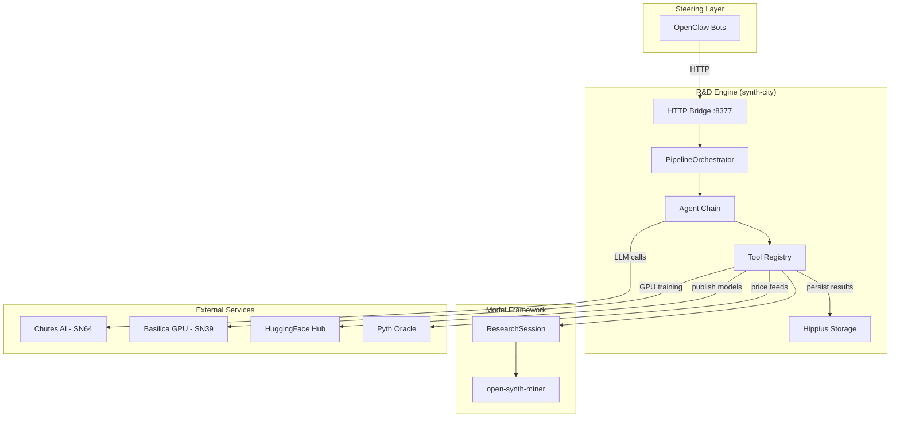
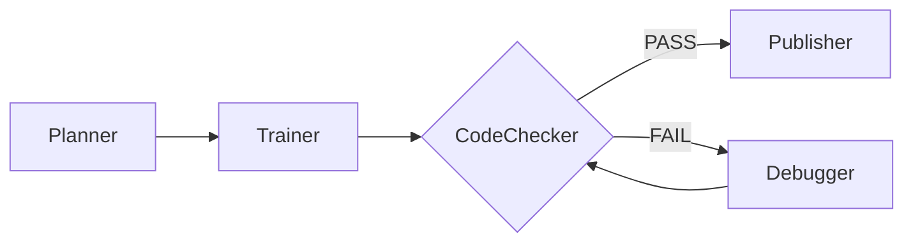
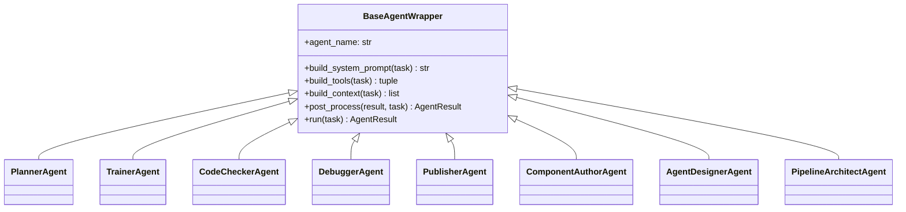
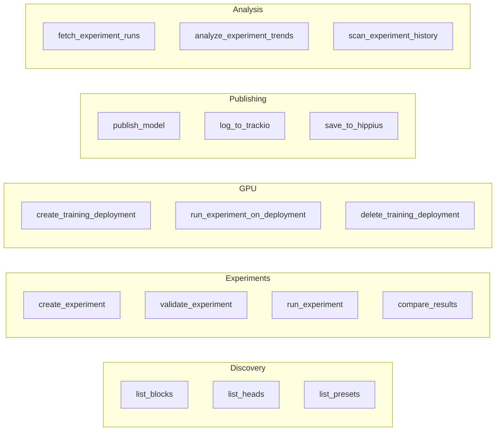
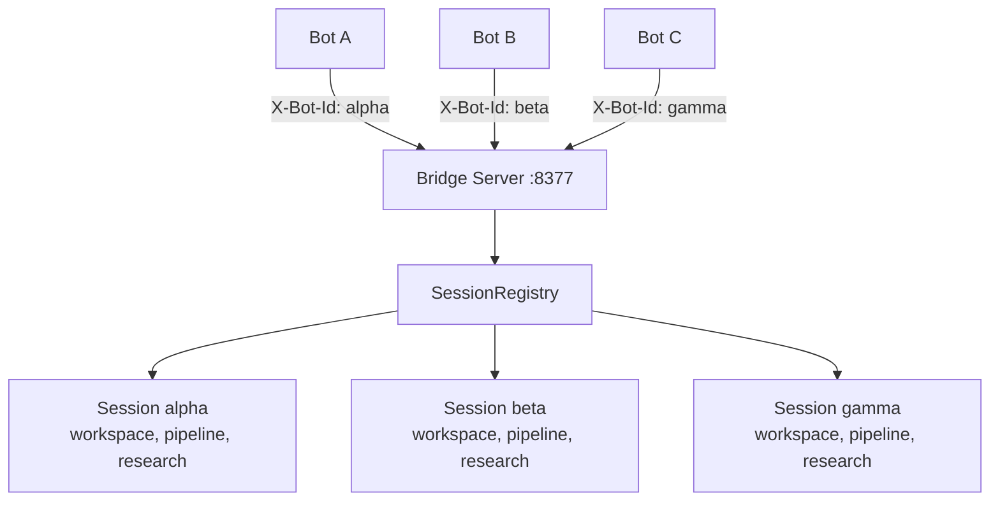

# Architecture

This document describes the high-level system design of synth-city, how data flows through the pipeline, and how components interact. For the reasoning behind these design choices, see [Philosophy](PHILOSOPHY.md).

---

## System Overview

synth-city is a three-layer stack that converts LLM reasoning into Bittensor mining rewards:



The **steering layer** (OpenClaw bots) provides human-in-the-loop control. The **R&D engine** (this repository) orchestrates agent reasoning and experiment execution. The **model framework** (open-synth-miner) handles PyTorch training and Monte Carlo path generation.

---

## Core Pipeline Flow

When you run `synth-city pipeline`, the `PipelineOrchestrator` executes a declarative sequence of stages. Each stage wraps a specialized agent:



The pipeline passes a shared `task` dictionary through each stage. Each agent reads from it and writes back its results:

| Stage | Reads from `task` | Writes to `task` |
|-------|-------------------|------------------|
| Planner | component registry, experiment history | `plan` (JSON experiment plan) |
| Trainer | `plan` | `best_experiment`, `best_metrics`, `comparison` |
| CodeChecker | `best_experiment`, run results | validation verdict |
| Debugger | error report, failed config | fixed `experiment` config |
| Publisher | `best_experiment`, `best_metrics` | HF Hub URL, W&B link |

The CodeChecker and Debugger operate in a loop: if validation fails, the Debugger fixes the config and the CodeChecker re-validates. This loop continues until validation passes or retries are exhausted.

---

## Agent Execution Model

Every agent in synth-city runs on the same engine: `SimpleAgent`, a ~200-line for-loop in `pipeline/providers/simple_agent.py`. There are no DAGs, no task graphs, and no state machines.

```
for turn in range(max_turns):
    response = llm.chat(messages, tools)
    if no tool calls:
        return response  # agent is done
    for each tool_call in response:
        result = execute_tool(tool_call)
        messages.append(result)
        if result.is_finish:
            return structured_result
return timeout
```

This mirrors natural LLM conversation: think, act (tool call), observe (tool result), repeat. The LLM is the planner — prompts guide its reasoning, and the loop keeps the conversation going.

### Termination

Agents stop in one of two ways:

1. **Implicit finish** — the LLM responds without any tool calls, indicating it has nothing more to do.
2. **Explicit finish** — the LLM calls the built-in `finish` tool with a structured result payload.

### Argument Coercion

LLMs produce imperfect JSON. The `_coerce_args()` function normalizes tool arguments before dispatch:

- Empty string `""` becomes an empty list `[]` when a list is expected
- JSON-in-string `"[1,2,3]"` is parsed into actual JSON
- String booleans `"true"` become real booleans
- String numbers `"42"` become real integers or floats

This centralized coercion means tool authors write clean Python functions with real types.

---

## Agent Composition

Agents are thin wrappers, not deep class hierarchies. Every agent subclasses `BaseAgentWrapper` and implements four hooks:



Each agent independently declares its system prompt, tool set, and context injection. There is no shared `super().build_tools()` to worry about. Adding a new agent means writing a single file in `pipeline/agents/` — no changes to existing agents or framework code.

### The Eight Agents

| Agent | Purpose | Key Tools |
|-------|---------|-----------|
| **Planner** | Survey components, review history, produce experiment plan | `list_blocks`, `list_heads`, `load_hippius_history`, `scan_experiment_history` |
| **Trainer** | Execute experiments on GPU, find best configuration | `create_experiment`, `run_experiment_on_deployment`, `compare_results` |
| **CodeChecker** | Validate experiment against SN50 specifications | `validate_experiment`, `describe_experiment` |
| **Debugger** | Fix failed experiments with error-aware reasoning | `create_experiment`, `validate_experiment`, GPU tools |
| **Publisher** | Push winning model to HF Hub + tracking services | `publish_model`, `log_to_trackio`, `save_to_hippius` |
| **Author** | Write new backbone blocks and prediction heads | `write_component`, `read_component`, `reload_registry` |
| **AgentDesigner** | Create new pipeline agents, prompts, and tools | `write_agent`, `write_agent_prompt`, `write_tool` |
| **PipelineArchitect** | Recompose the pipeline stages, tune retry strategy | `add_pipeline_stage`, `update_meta_strategy` |

---

## Tool Registry

Tools are the interface between agents and the outside world. The `@tool` decorator in `pipeline/tools/registry.py` auto-registers functions globally:

```python
@tool(description="List all available backbone blocks")
def list_blocks() -> str:
    ...
```

The registry:

1. Stores the function, description, and JSON schema in a global dictionary.
2. Infers the JSON schema from Python type hints (no manual schema writing).
3. Provides `build_toolset(*names)` for agents to select a scoped subset.

Each agent's `build_tools()` method returns only the tool names it needs. The Planner cannot accidentally start training; the Publisher cannot create experiments. This focused action space keeps each agent on task.

### Tool Categories



---

## Orchestration and Resilience

The `PipelineOrchestrator` wraps the agent chain with retry logic, temperature escalation, and stall detection.

### Temperature Escalation

When an agent fails, the orchestrator retries with increasing LLM temperature:

```
Attempt 1: temperature = 0.1  (focused, deterministic)
Attempt 2: temperature = 0.2  (slightly more creative)
Attempt 3: temperature = 0.3  (exploring alternatives)
...up to max_retries
```

Low temperature keeps the agent on track. Higher temperature introduces diversity, encouraging different approaches instead of repeating the same failing strategy.

### Stall Detection

The orchestrator detects when the Debugger produces the same experiment config across consecutive attempts. When detected, it injects a critical warning into the conversation:

> "CRITICAL WARNING: You MUST take a DIFFERENT approach. Your previous fix produced the same configuration."

This simple mechanism — string comparison of serialized configs — prevents the most common failure mode in agentic loops: repetitive, unproductive retries.

### Non-Recoverable Errors

The orchestrator recognizes certain errors as non-recoverable (missing dependencies, import failures) and stops retrying immediately rather than wasting turns.

### Meta-Strategy

The `MetaStrategy` class allows per-stage tuning of retry behavior:

- `max_retries` — how many attempts before giving up (1–20)
- `base_temperature` — starting LLM temperature (0.0–1.0)
- `temperature_step` — increment per retry (0.0–0.5)
- `stall_threshold` — consecutive identical configs before warning

The PipelineArchitect agent can modify these parameters at runtime, adapting the pipeline's resilience strategy based on observed behavior.

---

## Prompt Engineering

Sophistication lives in prompts, not framework code. The prompt system (`pipeline/prompts/`) uses composable fragments:

### Fragment Assembly

Prompts are built from named fragments with priorities. The `assemble_prompt()` function collects fragments by agent name and channel, sorts by priority, and concatenates:

```python
# Register a fragment
register_fragment("planner", "default", "role", "You are a research planner...", priority=10)
register_fragment("planner", "default", "phase1", "Phase 1: Diagnostic...", priority=20)
register_fragment("planner", "default", "phase2", "Phase 2: Plan...", priority=30)

# Assemble at runtime
prompt = assemble_prompt("planner", "default", task)
```

Fragments support `{variable}` substitution from the task context. This means prompts adapt to runtime conditions without code changes.

### Per-Agent Strategies

| Agent | Prompting Strategy |
|-------|--------------------|
| **Planner** | Two-phase reasoning: diagnostic (discover components, review history) then execution plan |
| **Trainer** | Experiment execution protocol with validation-before-training discipline |
| **CodeChecker** | Structured validation checklist covering config, architecture, composition, and results |
| **Debugger** | Error pattern catalog mapping failure modes to known fixes |
| **Publisher** | Publishing procedure with final validation gate |
| **Author** | Component authoring guidelines with tensor interface contract |

---

## Data Persistence

### Hippius Storage (SN30)

Experiment results are persisted to Hippius, an S3-compatible decentralized storage network, with this layout:

```
synth-city/                                (bucket)
├── experiments/{run_id}/{name}.json       individual experiment result
├── pipeline_runs/{run_id}/summary.json    full pipeline run summary
├── pipeline_runs/{run_id}/comparison.json CRPS ranking at end of run
└── pipeline_runs/latest.json              pointer to most recent run
```

The Planner loads past results from Hippius to inform future experiments, creating a feedback loop where each pipeline run builds on previous discoveries.

### Session Memory Management

The `ResearchSession` tracks experiment results in memory. When the session exceeds 100 results, it auto-flushes to Hippius, retaining only the top 10 results in memory. This prevents unbounded memory growth during long runs.

---

## Multi-Bot Architecture

The HTTP bridge server (`integrations/openclaw/bridge.py`) supports concurrent access from multiple OpenClaw bots:



Each bot is identified by the `X-Bot-Id` HTTP header and gets an isolated `BotSession` containing:

- Its own workspace directory
- Its own `ResearchSession` instance
- Its own `PipelineState` (running/idle, current stage)
- A unique `run_id` for Hippius storage

The `SessionRegistry` manages bot sessions with:

- **TTL-based cleanup** — idle sessions are reaped after 1 hour (configurable via `BOT_SESSION_TTL_SECONDS`)
- **Concurrency limits** — a global semaphore caps concurrent pipeline runs at 10 (configurable via `MAX_CONCURRENT_PIPELINES`)
- **Cross-bot comparison** — the `/experiment/compare/all` endpoint ranks experiments from all active sessions together

---

## LLM Provider Integration

All LLM calls go through the Chutes AI client (`pipeline/providers/chutes_client.py`), which speaks the OpenAI-compatible chat completions protocol. The client is configured once and cached:

```python
client = get_chutes_client()  # singleton, lru_cache(maxsize=1)
```

Resilience is handled at two levels:

1. **OpenAI SDK retries** — 3 automatic retries on transient HTTP errors
2. **Outer backoff** — `chat_completion_with_backoff()` adds 4 more retries with exponential delays (2s, 4s, 8s, 16s)

Per-agent model selection is controlled through environment variables (`PLANNER_MODEL`, `TRAINER_MODEL`, etc.), allowing larger reasoning models for complex tasks (Planner) and smaller code-tuned models for mechanical tasks (CodeChecker).

---

## GPU Compute Integration

The `BasilicaGPUClient` (`compute/basilica.py`) wraps the Basilica GPU marketplace (Bittensor SN39) with budget-aware filtering:

1. **Discovery** — `list_cheap_gpus()` queries available GPUs and filters by `BASILICA_MAX_HOURLY_RATE` and `BASILICA_ALLOWED_GPU_TYPES`.
2. **Deployment** — `create_deployment()` spins up a Docker-based GPU pod running the training server image (`ghcr.io/tensorlink-ai/synth-city-gpu:latest`).
3. **Training** — `run_experiment_on_deployment()` sends experiment configs to the pod via HTTP and collects results.
4. **Cleanup** — `delete_deployment()` terminates the pod when training completes.

The training server (`compute/training_server.py`) runs inside the GPU pod and exposes an HTTP API that receives experiment configs, runs them through the ResearchSession, and returns metrics.

---

## Scoring and Validation

### CRPS (Continuous Ranked Probability Score)

CRPS is the competition metric for Bittensor SN50. It measures how well a predicted probability distribution matches observed prices. The implementation in `subnet/validator.py` computes:

```
CRPS = mean(|forecast_i - observation|) - 0.5 * mean(|forecast_i - forecast_j|)
```

Lower CRPS indicates better calibration. Scores are evaluated at 9 time horizons: 5, 10, 15, 30, 60, 180, 360, 720, and 1440 minutes.

### SN50 Output Validation

The `check_shapes` tool validates model outputs against SN50 requirements:

- Shape must be `[1000, 289]` (1000 Monte Carlo paths, 289 timesteps including t0)
- No NaN or Inf values
- All values must be positive (they represent prices)

The CodeChecker agent uses `validate_experiment` and `describe_experiment` to programmatically verify these constraints before the Publisher ships anything to production.

### Score Tracker

The `ScoreTracker` class (`subnet/score_tracker.py`) provides a local replica of the SN50 validator scoring loop. It records predictions, collects realized prices over time, and scores them using the same CRPS calculation validators use. The `ScoringDaemon` runs this process continuously in a background thread, enabling real-time performance monitoring without submitting to the actual network.
