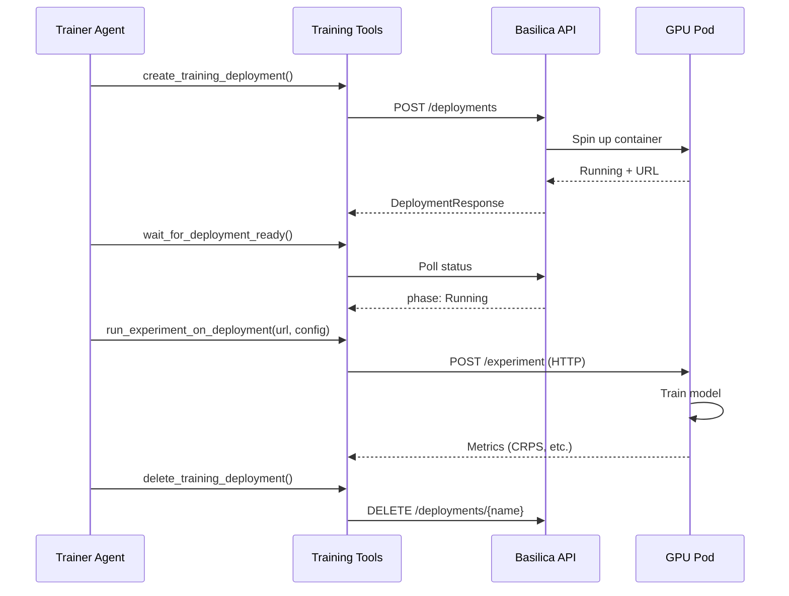

# Deployment

This guide covers building, deploying, and running synth-city in production — from Docker builds and GPU pod deployments to Bittensor mining setup and bridge server operation.

---

## Deployment Options

synth-city supports several deployment patterns depending on your use case:

| Pattern | When to use | Infrastructure |
|---------|-------------|----------------|
| **Local CLI** | Development, quick experiments | Local machine with Python 3.10+ |
| **Docker (bridge)** | Production bridge server for bots | Docker host with GPU |
| **Basilica GPU pods** | Remote training at scale | Basilica account (SN39) |
| **Full mining stack** | Competing on SN50 | GPU server + Bittensor wallet |

---

## Docker

### GPU Training Image

The `Dockerfile` builds a GPU-capable training image based on `nvidia/cuda:12.2.0-runtime-ubuntu22.04`.

```bash
docker build -t synth-city-gpu .
```

The build process:

1. Installs Python 3, pip, git, and curl
2. Copies `uv` (fast package manager) from `ghcr.io/astral-sh/uv:latest`
3. Clones and installs open-synth-miner
4. Installs PyTorch with CUDA 12.1 support
5. Copies and installs synth-city
6. Validates that ResearchSession is importable and CUDA is available

The image exposes port 8377 (bridge server) and defaults to running `python main.py bridge`.

### docker-compose

The `docker-compose.yml` defines two services:

#### Bridge Service (runs 24/7)

```bash
docker compose up -d bridge
```

This starts the HTTP bridge server with GPU access, persistent workspace volume, and automatic restart.

#### CLI Runner (one-off commands)

```bash
docker compose run synth pipeline --publish
docker compose run synth sweep --epochs 3
docker compose run synth agent --name planner
```

The `synth` service uses the `cli` profile and shares the same workspace volume as the bridge.

### Environment Variables

Pass your `.env` file to Docker:

```bash
docker compose --env-file .env up -d bridge
```

Or set variables directly:

```bash
docker run -e CHUTES_API_KEY=your-key -e BRIDGE_HOST=0.0.0.0 \
  -p 8377:8377 --gpus all synth-city-gpu bridge
```

### Building the GPU Image for CI

The `docker-gpu.yml` GitHub Actions workflow automatically builds and pushes the GPU image to GitHub Container Registry when `Dockerfile.gpu` or `compute/training_server.py` changes on `main`.

The image is tagged as:
- `ghcr.io/{owner}/synth-city-gpu:latest`
- `ghcr.io/{owner}/synth-city-gpu:{git-sha}`

---

## Basilica GPU Deployments (SN39)

For training that exceeds local GPU capacity, synth-city deploys Docker-based GPU pods on the Basilica marketplace.

### How It Works



### Configuration

Set these in your `.env`:

```bash
BASILICA_API_TOKEN=your-token
BASILICA_MAX_HOURLY_RATE=0.44
BASILICA_ALLOWED_GPU_TYPES=TESLA V100,RTX-A4000,RTX-A6000
BASILICA_DEPLOY_IMAGE=ghcr.io/tensorlink-ai/synth-city-gpu:latest
BASILICA_DEPLOY_MIN_GPU_MEMORY_GB=12
BASILICA_DEPLOY_CPU=2000m
BASILICA_DEPLOY_MEMORY=8Gi
```

### Available GPUs (within default budget cap)

| Provider | GPU | Spot | Price/hr |
|----------|-----|------|----------|
| verda | TESLA V100 | Yes | $0.05 |
| verda | TESLA V100 | No | $0.15 |
| hyperstack | RTX-A4000 | No | $0.16 |
| hyperstack | 2x RTX-A4000 | No | $0.33 |
| hyperstack | RTX-A6000 | Yes | $0.44 |

### Deployment Lifecycle

The Trainer agent manages the full lifecycle automatically:

1. **Check balance** — `check_gpu_balance()` to verify funds
2. **Create deployment** — `create_training_deployment()` spins up a pod
3. **Wait for ready** — `wait_for_deployment_ready()` polls until Running
4. **Train** — `run_experiment_on_deployment()` sends config and collects results
5. **Clean up** — `delete_training_deployment()` terminates the pod

The deployment includes retry logic (3 attempts with exponential backoff) and health checks.

### Manual GPU Management

For direct GPU rental (SSH access) rather than managed deployments:

```python
from compute.basilica import BasilicaGPUClient

client = BasilicaGPUClient()

# List affordable GPUs
for gpu in client.list_cheap_gpus():
    print(f"{gpu.gpu_type} @ ${gpu.hourly_rate}/hr")

# Rent the cheapest
rental = client.rent_cheapest(ssh_key_id)
print(f"SSH: {rental.ssh_command}")

# Stop when done
client.stop_rental(rental.rental_id)
```

---

## Bridge Server

The HTTP bridge server is the primary production deployment for synth-city. It exposes all pipeline operations as REST endpoints.

### Starting the Server

```bash
# Default: localhost:8377
synth-city bridge

# Bind to all interfaces (for remote access)
synth-city bridge --host 0.0.0.0

# Custom port
synth-city bridge --port 9000
```

### Securing the Bridge

For production deployments exposed to the network:

**Option A: SSH tunnel (recommended)**

Keep the bridge on localhost and tunnel from the client machine:

```bash
# On the client machine
ssh -L 8377:localhost:8377 user@gpu-server -N
```

This encrypts traffic and requires no configuration changes.

**Option B: API key authentication**

Set `BRIDGE_API_KEY` in `.env`:

```bash
BRIDGE_HOST=0.0.0.0
BRIDGE_API_KEY=your-secret-key
```

All requests must include the `X-API-Key` header. Comparison uses HMAC-safe constant-time comparison. Maximum request body size is 1 MB.

### Multi-Bot Setup

Multiple OpenClaw bots can connect simultaneously. Each bot sends an `X-Bot-Id` header to get an isolated session:

```bash
# Bot identifies itself
curl -H "X-Bot-Id: alpha" http://localhost:8377/components/blocks
curl -H "X-Bot-Id: beta" http://localhost:8377/experiment/compare
```

Configure concurrency limits:

```bash
MAX_CONCURRENT_PIPELINES=10    # max parallel pipeline runs
BOT_SESSION_TTL_SECONDS=3600   # idle session timeout
```

### Health Monitoring

```bash
curl http://localhost:8377/health
# {"status": "ok", "active_bots": 3}

curl http://localhost:8377/dash/snapshot
# Full monitoring snapshot

curl http://localhost:8377/dashboard
# HTML dashboard
```

---

## Bittensor Mining Setup

To compete as a miner on Subnet 50 (Synth).

### 1. Install Bittensor

```bash
pip install bittensor
```

### 2. Create a Wallet

```bash
btcli wallet new_coldkey --wallet.name default
btcli wallet new_hotkey --wallet.name default --wallet.hotkey default
```

Store your mnemonic securely. The coldkey controls your funds; the hotkey is used for mining operations.

### 3. Fund Your Wallet

You need TAO to register on the subnet. Transfer TAO to your coldkey address.

### 4. Register on SN50

```bash
btcli subnet register --netuid 50 --wallet.name default --wallet.hotkey default
```

Registration cost varies with network demand.

### 5. Configure synth-city

```bash
BT_WALLET_NAME=default
BT_HOTKEY_NAME=default
BT_NETWORK=finney
BT_NETUID=50
```

### 6. Train and Deploy

```bash
# Run the pipeline to find the best model
synth-city pipeline --publish

# Or let bots drive the research
synth-city bridge
```

### Prediction Requirements

Each SN50 submission must provide:

| Requirement | Value |
|-------------|-------|
| Monte Carlo paths per asset | 1,000 |
| Timesteps (24h horizon) | 289 (including t0) |
| Timesteps (1h HFT horizon) | 13 |
| Step interval | 5 minutes |
| Path values | Positive, no NaN/Inf |
| Assets | BTC, ETH, SOL, XAU, SPYX, NVDAX, TSLAX, AAPLX, GOOGLX |

### Scoring Emulator

Run a local replica of the SN50 validator scoring loop to test your models before deploying:

```bash
synth-city score
```

The `ScoreTracker` and `ScoringDaemon` continuously generate predictions, collect realized prices, and compute CRPS scores at all evaluation horizons.

---

## OpenClaw Skill Deployment

### Install the Skill

```bash
python integrations/openclaw/setup.py
```

This installs the synth-city skill into your OpenClaw workspace, making all bridge tools available to OpenClaw bots.

### Publish to ClawHub

```bash
python integrations/openclaw/publish.py
```

Publishes the skill to ClawHub for other users. Includes retry logic with exponential backoff for rate limiting.

### Skill Configuration

The OpenClaw skill reads these environment variables:

| Variable | Default | Description |
|----------|---------|-------------|
| `SYNTH_BRIDGE_URL` | `http://127.0.0.1:8377` | Bridge server URL |
| `BRIDGE_API_KEY` | `""` | API key for authentication |
| `SYNTH_BOT_ID` | `""` | Bot identifier for session isolation |

---

## Infrastructure Requirements

### Minimum (Research/Development)

| Resource | Requirement |
|----------|-------------|
| CPU | 2 cores |
| RAM | 4 GB |
| Disk | 4 GB |
| GPU | Optional (CPU training works but is slower) |
| Network | Internet access for LLM API calls |

### Recommended (Production Mining)

| Resource | Requirement |
|----------|-------------|
| CPU | 4+ cores |
| RAM | 16 GB |
| Disk | 20 GB |
| GPU | NVIDIA V100/A4000/A6000 (or use Basilica) |
| Network | Stable connection for bridge server + API calls |

### Services

| Service | Required | Purpose |
|---------|----------|---------|
| Chutes AI (SN64) | Yes | LLM inference for agent reasoning |
| Basilica (SN39) | Recommended | Remote GPU training |
| Hippius (SN30) | Recommended | Persistent experiment storage |
| HuggingFace Hub | Optional | Model publishing |
| Weights & Biases | Optional | Experiment tracking |

---

## Production Checklist

Before deploying to production:

- [ ] `.env` configured with all required API keys
- [ ] `BRIDGE_API_KEY` set (if bridge is network-accessible)
- [ ] `BRIDGE_HOST=0.0.0.0` (if accepting remote connections)
- [ ] GPU access verified (`nvidia-smi` or Basilica balance check)
- [ ] Hippius credentials configured for experiment persistence
- [ ] HuggingFace token configured for model publishing
- [ ] Bittensor wallet registered on SN50
- [ ] Docker image built and tested
- [ ] Scoring emulator running to monitor model quality
- [ ] Log rotation configured (`LOG_DIR`, logs rotate at 20 MB with 5 backups)
